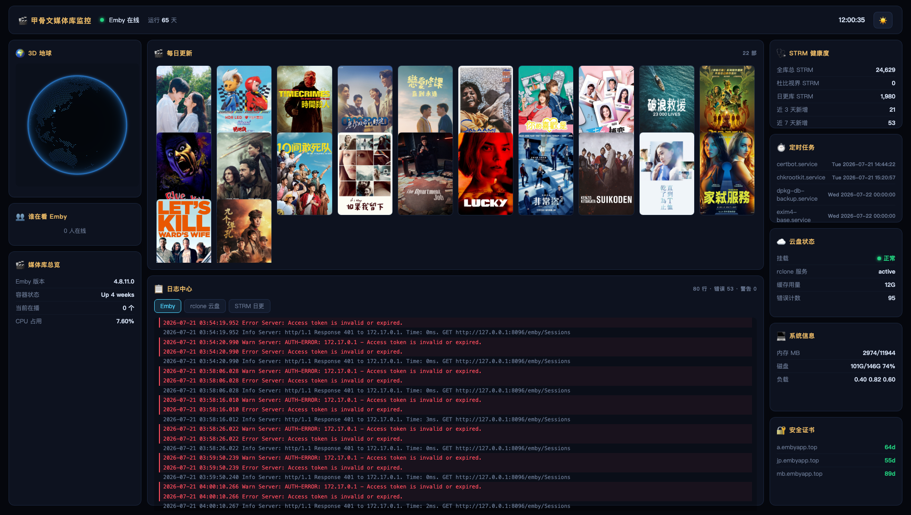

# 🎬 甲骨文 Emby 媒体库监控大屏

> 一个美观实用的 Emby 媒体库实时监控仪表盘，带 3D 地球在线用户光点，每日更新海报墙，系统状态监控，STRM 健康度统计，定时任务展示。

## 📖 项目背景

这是为甲骨文云日本服务器 Emby 媒体库开发的 homelab 监控大屏，专注于：
- 📊 **STRM 媒体库健康度监控** - 实时统计新增数量，掌握日更进度
- 👥 **实时在线用户观测** - 知道谁在看，看什么，在哪里看
- 🗓️ **系统定时任务一目了然** - STRM 更新、证书续期、系统维护都能看到
- 🎨 **美观现代的 UI 设计** - 深色主题，三栏布局，信息清晰不拥挤

## ✨ 功能特性

| 功能 | 描述 | 状态 |
|------|------|------|
| 🌍 **3D 地球** | 显示当前在线用户，根据 IP 真实地理位置显示光点，点击光点直接跳转播放 | ✅ 完成 |
| 👥 **Who's Watching** | 列表显示在线用户：区域 + IP + 用户名 + 设备 + 当前正在播放影片 | ✅ 完成 |
| 🎬 **每日更新海报墙** | 显示最近入库的电影/电视剧海报，**限制 22 个避免拥挤**，电影电视剧随机排列 | ✅ 完成 |
| 🔗 **正确跳转 Emby** | 点击海报直接跳转到 `https://tv.embyapp.top` 对应影片播放页 | ✅ 完成 |
| 🩺 **STRM 健康度** | 详细统计 STRM 文件：全库总数、杜比视界数量、日更库数量、近 3 天/7 天新增 | ✅ 完成 |
| ⏱️ **定时任务** | 显示所有 systemd 定时任务和下次运行时间，包括 STRM 自动更新任务 | ✅ 完成 |
| ☁️ **云盘状态** | 显示 Rclone 云盘挂载状态、缓存用量、错误计数 | ✅ 完成 |
| 💻 **系统信息** | CPU、内存、磁盘、负载实时显示 | ✅ 完成 |
| 🔐 **SSL 证书** | 显示 Let's Encrypt 证书剩余天数 | ✅ 完成 |
| 📝 **日志中心** | 实时查看 Emby/Rclone/STRM 日志，支持 tab 切换 | ✅ 完成 |
| 🌓 **深色/浅色主题** | 支持一键切换主题，自动保存偏好 | ✅ 完成 |

## 📐 布局结构

严格三栏布局，每个模块都有合适的尺寸，不会出现长条溢出：

| 📍 位置 | 宽度 | 模块 |
|--------|------|------|
| **左栏** | 280px | 🌍 3D 地球 → 👥 谁在看 Emby → 📊 媒体库总览 |
| **中栏** | 自适应 | 🎬 每日更新海报墙（上） → 📝 日志中心（下） |
| **右栏** | 280px | 🩺 STRM 健康度 → ⏱️ 定时任务 → ☁️ 云盘 → 💻 系统 → 🔐 证书 |

## 📊 STRM 健康度统计

面板现在包含以下详细信息：

| 统计项 | 说明 |
|--------|------|
| **全库总 STRM** | 整个 `/home/syncthing` 目录下所有 `.strm` 文件总数 |
| **杜比视界 STRM** | 包含 `doVi` 标记的杜比视界 STRM 文件数量 |
| **日更库 STRM** | `/home/syncthing/daily_strm_new` 目录下的 STRM 数量 |
| **近 3 天新增** | 最近 3 天新增的 STRM 文件数量 |
| **近 7 天新增** | 最近 7 天新增的 STRM 文件数量 |

## ⏰ 定时任务展示

自动收集所有 systemd 定时任务，显示任务名称和下次运行时间：

常见任务示例：
- `certbot.service` - SSL 证书自动续期
- `daily-strm-weekly.service` - STRM 每日更新同步
- `dolby-strm-weekly.service` - 杜比视界 STRM 处理
- `strm-deadlink-monthly.service` - STRM 死链月度检查
- `apt-daily.service` - 系统自动更新
- `fstrim.service` - SSD 定期trim优化

## 🎬 每日更新海报墙

- ✅ 只包含 **电影 + 电视剧**，不包含演员/导演
- ✅ 限制 **最多 22 个海报**，避免布局拥挤重叠
- ✅ 每次刷新 **随机打乱顺序**，电影电视剧混排
- ✅ 点击海报直接跳转 Emby 正确播放页

## 🚀 快速部署

### 1. 克隆项目到服务器
```bash
git clone https://github.com/ZHANGFA88/oracle-media-dashboard.git
cd oracle-media-dashboard
chmod +x *.sh
```

### 2. 修改配置
编辑 `serve_media.py` 修改：
```python
PORT = 8771              # 监控端口
EMBY_KEY = "你的 API Key"  # Emby API Key
EMBY_HOST = "127.0.0.1:8096" # Emby 地址
```

### 3. 修改海报跳转链接（重要！）
编辑 `public/media.html`，大约在 320 行，修改跳转链接为你的 Emby 地址：
```javascript
return `<a href="https://你的emby域名/web/index.html#!/item?id=${m['id']}&serverId=你的serverId" ...`
```
- `serverId` 在你打开 Emby 任意影片的时候可以从 URL 中获取
- 本项目已经预置了 `serverId=a4893e3421b84f6381cfdcc7d6f28ab6`，如果你的和这个不一样，请修改

### 4. 修改 STRM 统计路径
如果你的 STRM 存放路径不是 `/home/syncthing`，需要编辑 `collect_media.sh` 修改：
```bash
STRM_DAILY=$(strm_count /home/syncthing/daily_strm_new)  # 修改日更库路径
STRM_TOTAL=$(timeout 60 find /home/syncthing -name "*.strm" ...)  # 修改全库路径
```

### 5. 安装 systemd 服务
```bash
cp media-dashboard.service /etc/systemd/system/
# 如果你安装路径不是 /root/media-dashboard，需要编辑 service 文件修改路径
# 编辑 ExecStart 和 WorkingDirectory
systemctl daemon-reload
systemctl enable media-dashboard
systemctl start media-dashboard
```

### 6. 访问
打开浏览器访问：
```
http://你的服务器IP:8771
```

### 7. 检查运行状态
```bash
# 查看状态
systemctl status media-dashboard

# 查看日志
journalctl -u media-dashboard -f

# 手动测试API
curl -s http://127.0.0.1:8771/api/media/movies
# 应该返回一个 JSON 数组，包含 22 个电影电视剧
```

## 📁 项目结构

```
oracle-media-dashboard/
├── README.md              # 📝 项目说明文档
├── collect_media.sh       # 📊 统计数据采集脚本
├── serve_media.py         # 🚀 Python HTTP 服务端
├── media-dashboard.service # ⚙️ systemd 服务配置文件
└── public/
    ├── media.html         # 🎨 前端大屏页面
    └── cobe.js            # 🌍 3D 地球渲染库
```

## 🔧 依赖

- Python 3.7+
- Linux (systemd)
- **无需额外 Python 依赖**，全部使用标准库
- Emby/Jellyfin 媒体服务器
- 可选：rclone 云盘挂载，STRM 自动同步任务

## 📝 说明

- 💯 **完全只读**：不修改 Emby 任何数据，只做监控展示
- 🔄 **自动刷新**：所有数据每分钟更新一次
- 🖼️ **海报代理**：海报图片通过 Emby API 代理获取，无需本地存储
- 📍 **IP 定位**：使用免费 ip-api.com 服务获取真实地理位置

## 🎨 截图预览

### 🖥️ 完整大屏界面


### 📊 STRM 健康度面板

```
 🩺 STRM 健康度
─────────────────────────────────
全库总 STRM        24,629
杜比视界 STRM            0
日更库 STRM          1,980
近 3 天新增              21
近 7 天新增              53
```

### ⏰ 定时任务面板

```
 ⏱️ 定时任务
─────────────────────────────────
certbot.service             Tue 2026-07-21 14:44:22
daily-strm-weekly.service   Wed 2026-07-22 06:05:20
dolby-strm-weekly.service   Fri 2026-08-07 04:47:51
...
```

## 🎯 特色

- 原生 JavaScript + CSS，不需要 Node.js，不需要打包，直接运行
- 响应式布局，适配不同屏幕
- 美观的毛玻璃效果面板
- 星空渐变背景，现代UI设计
- 代码简洁，易于二次开发

## 🎨 致谢

- [cobe](https://github.com/evanw/cobe) - 优秀的 3D 地球渲染库
- 灵感来自金融可视化大屏

## 📄 许可证

MIT License

## ⚠️ 安全提示

- 💯 **完全只读**：这个项目只读取统计信息，**不会修改 Emby 任何数据**，也不会修改你的媒体文件
- 🔑 API Key 只在服务端使用，不会泄露给前端
- 📝 建议放在内网访问，或者添加反向代理认证
- 🐳 如果你用 Docker 运行 Emby，只需要修改 `collect_media.sh` 中的路径即可

## 📸 效果截图

### 🖥️ 完整大屏截图



### 📊 右栏面板效果

```
┌─────────────────────────────────┐
│  🩺 STRM 健康度                │
├─────────────────────────────────┤
│  全库总 STRM       24,629       │
│  杜比视界 STRM          0       │
│  日更库 STRM        1,980       │
│  近 3 天新增             21     │
│  近 7 天新增             53     │
└─────────────────────────────────┘
┌─────────────────────────────────┐
│  ⏱️ 定时任务                   │
├─────────────────────────────────┤
│  certbot.service       今天 14:44│
│  daily-strm...        明天 06:05│
│  dolby-strm...        下周 周五  │
│  ...                              │
└─────────────────────────────────┘
┌─────────────────────────────────┐
│  ☁️ 云盘状态                   │
├─────────────────────────────────┤
│  挂载             ✅ 正常       │
│  rclone 服务       active       │
│  缓存用量          12G          │
│  错误计数          95           │
└─────────────────────────────────┘
```

### 🎬 每日更新海报墙

- 网格布局，自动适应宽度
- 每个海报保持 2:3 比例
- 鼠标悬停放大效果
- 点击直接跳转 Emby
- **限制 22 个**，不会拥挤重叠

## ❓ 常见问题与故障解决

### Q1: 定时任务面板是空的，不显示？
**A:** 检查 `collect_media.sh` 是否有执行权限，并且确认你的系统使用 `systemd`（大部分 Linux 发行版都是 systemd）。

### Q2: 每日更新海报墙是空的？
**可能原因：**
1. API Key 不正确 → 检查 `serve_media.py` 中的 `EMBY_KEY` 是否完整正确
2. Emby 地址不对 → 检查 `EMBY_HOST`
3. 过滤条件太严 → 本项目已经放宽过滤条件，只要有 Primary 图片标签就显示

**解决：**
```bash
# 直接测试 API
curl -s http://127.0.0.1:8771/api/media/movies
# 如果返回 [] 空数组，说明后端收集有问题
# 如果返回 JSON 数组但是前端不显示，检查前端缓存，强制刷新
```

### Q3: 点击海报跳转 404？
**A:** 确认你的 Emby 公网地址，修改 `public/media.html` 中的跳转链接：
```javascript
// 在大约 320 行，修改 href 为你的地址
return `<a href="https://你的域名/web/index.html#!/item?id=${m['id']}&serverId=你的serverId" ...`
```

### Q4: STRM 统计很慢，超时？
**A:** 脚本已经加了超时保护：
- 全库统计超时 60 秒
- 如果你的STRM文件特别多，可以修改超时时间在 `collect_media.sh`
- 统计是每分钟更新一次，不影响前端访问

### Q5: 服务启动失败？
**检查：**
```bash
systemctl status media-dashboard
journalctl -u media-dashboard -f
```
常见问题：
- Python 版本太低 → 需要 Python 3.7+
- 路径不对 → 检查 `media-dashboard.service` 中的路径是否和你的安装路径一致

### Q6: 怎么修改海报数量限制？
**A:** 在 `serve_media.py` 中找到这行修改：
```python
return self._json(200, out[:22])  # 修改 22 为你想要的数量
```

## 📝 更新日志

### v1.0.0 (2026-07-21)

✅ 完成所有核心功能：
- 🌍 3D 地球显示在线用户光点（真实 IP 定位）
- 👥 "Who's Watching" 列表显示区域+IP+用户+正在播放
- 🎬 每日更新海报墙（22个限制，电影电视剧随机混排）
- 🔗 正确跳转 Emby 播放页
- 🩺 STRM 健康度详细统计（全库/杜比/日更/近3天/近7天）
- ⏱️ systemd 定时任务显示
- ☁️ Rclone 云盘状态监控
- 💻 系统信息监控
- 🔐 SSL 证书剩余天数显示
- 📝 多标签日志中心
- 🌓 深色/浅色主题切换

---

👨‍💻 **作者：壮壮 (ZHANGFA88)**

*项目由 OpenClaw AI 辅助开发完成 🤖*
